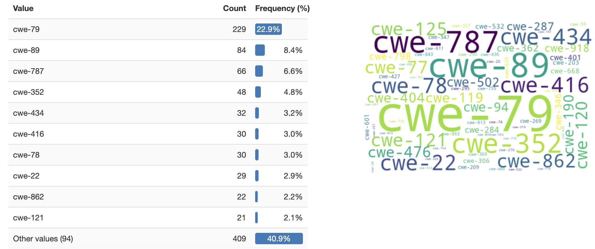
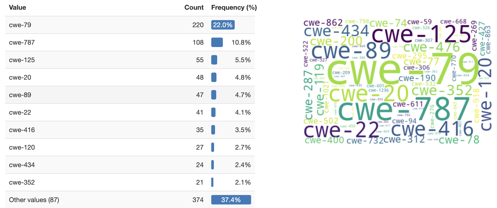

# CVE-CWE Mapping Analysis Report

This repository contains data profiling and analysis reports for the Cyber Threat Intelligence Root Cause Mapping (CTI-RCM) benchmark dataset https://github.com/xashru/cti-bench/.

## Datasets

### 2024 Dataset (data_in/cti-rcm.tsv)
* Contains 
  * 1000 unique CVEs
  * 988 unique CVE Descriptions
  * 104 distinct CWEs
* Top 10 CWE values account for ~59% of the CWEs in the dataset
* CWE-79 (Cross-site Scripting) accounts for ~23% of all vulnerabilities

### 2021 Dataset (data_in/cti-rcm-2021.tsv)
* Contains 
  * 1000 unique CVEs
  * 957 unique CVE Descriptions
  * 97 distinct CWEs
* Top 10 CWE values account for ~63% of the CWEs in the dataset
* CWE-79 (Cross-site Scripting) accounts for 22% of all vulnerabilities

## Data In
A local copy of these files is stored in data_in:

- https://github.com/xashru/cti-bench/blob/main/data/cti-rcm.tsv
- https://github.com/xashru/cti-bench/blob/main/data/cti-rcm-2021.tsv

## Reports

Detailed interactive reports have been generated using ydata_profiling and are available in the reports directory:

* [2024 CVE Analysis Report](reports/cti-rcm_profile_report.html)
* [2021 CVE Analysis Report](reports/cti-rcm-2021_profile_report.html)

These reports include:
* Comprehensive statistical analysis of the datasets
* Detailed breakdowns of CWE distributions
* Correlation analyses between different variables
* Insights about description length and content patterns

## Usage

To regenerate these reports or analyze additional datasets, 
1. use the provided Python Notebook: cti_bench_analyze.ipynb
2. open the resulting html files in the reports dir.

